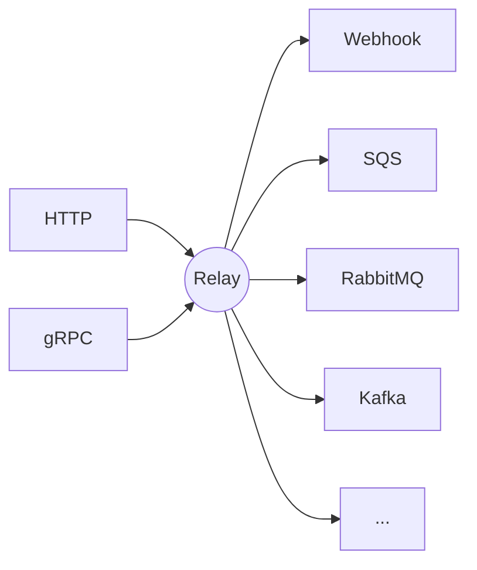
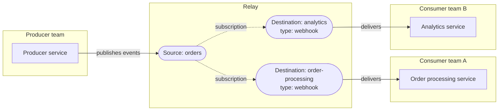
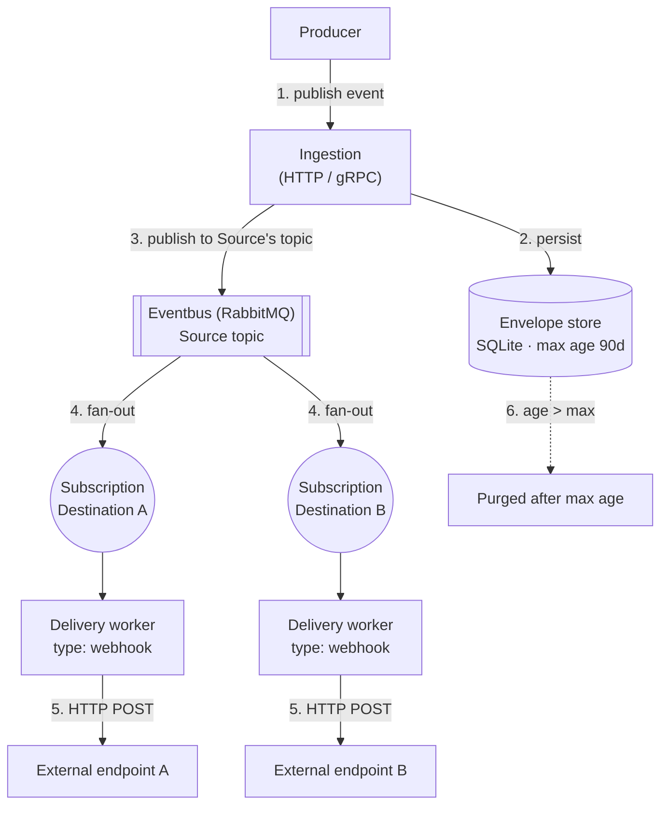

# Relay Architecture

This document is an overview of how Relay is put together: the concepts it
exposes, how data flows through it, and the constraints that shape it. It
covers what's built today and the target shape the project is heading
toward, calling out the difference so it doesn't go stale as pieces land.

See [CONTRIBUTING.md](../CONTRIBUTING.md) for the file-by-file project layout
and local dev workflow.

## Problem Relay solves

Event-driven systems tend to couple producers to the infrastructure that
consumes their events: a service that emits `order.created` ends up knowing
it needs to write to a specific SQS queue or RabbitMQ exchange. Relay sits
between producers and that infrastructure. Producers publish events to Relay
over a transport they don't have to think about (HTTP today, gRPC planned).
Consumers register to receive events without the producer knowing or caring
how they're delivered.

## Self-service model

Sources and Destinations are both independently self-service resources:
whichever team owns a producer or a consumer manages its own registration —
create, update, deactivate, delete — without a shared operator provisioning
anything on their behalf.

- **Source** — a registered origin allowed to publish events into Relay
  (e.g. `orders`). Owned by the producing team.
- **Destination** — a registered target Relay delivers events to (e.g. a
  webhook URL). Owned by the consuming team, and configured with a delivery
  type and whatever that type needs to receive a delivery.

The link between them is a **subscription**: a Destination subscribes to one
or more topics published by a Source. This is what fans one event out to
several destinations, and what lets a Destination start or stop receiving
events without the Source changing anything. Sources publish without
knowing who's listening; Destinations declare interest without knowing who's
publishing.

Today: Source CRUD is fully implemented. Destination CRUD and subscriptions
are modeled but not yet exposed via the API.

## Envelopes

An **Envelope** is one event accepted from a Source: the message body plus
the metadata Relay needs to route it (currently a routing key/topic).
Envelopes are immutable once accepted.

Relay is **not a durable event store**. Envelope persistence is short-term
and exists to support retries and operational visibility, not replay or
archival. It's configurable with a maximum age (default guidance: 90 days),
after which envelopes are purged. Today the only supported persistence
backend is SQLite; this is expected to stay pluggable but does not need to
scale beyond a short retention window the way a log-structured store would.

## The eventbus: routing lives there, not in Relay

Between accepting an Envelope and delivering it, Relay hands routing off to
an **eventbus** rather than reimplementing pub/sub matching itself. A
Source's topic and a Destination's subscription map onto the eventbus's own
native routing primitives (e.g. a RabbitMQ exchange and a bound queue) — the
eventbus decides which bound consumers get a given message, and Relay's job
is to publish into it and consume out of it, not to compute fan-out itself.

The **only** eventbus supported to start is **RabbitMQ**. The abstraction is
expected to expand to Kafka and others later, but the interface Relay codes
against should not assume RabbitMQ-specific semantics beyond "publish to a
topic, consume matching subscriptions."

Hard architectural constraint: **the eventbus is invisible to everyone
outside Relay.** Neither a Source owner nor a Destination owner is ever
aware which eventbus is in use, sees any of its native concepts (exchanges,
queues, topics-as-infrastructure), or configures it directly — it is purely
Relay's internal implementation detail for getting an Envelope from
ingestion to delivery. A Destination's delivery *type* (webhook, SQS, ...)
is a separate, user-facing concept and must not be conflated with the
internal eventbus.

## Destination delivery types

A Destination's delivery type determines how Relay hands off a matched
Envelope on the way out: an HTTP call for a webhook, a native publish for
SQS/RabbitMQ/Kafka destinations, etc.

**MVP scope is webhook only.** Other delivery types (SQS, RabbitMQ, Kafka as
destinations — distinct from RabbitMQ as the internal eventbus) are planned
but out of scope until webhook delivery is solid.

## Event flow (target state)

Routing (step 4) is computed entirely by the eventbus, driven by
subscriptions — Relay never matches Sources to Destinations itself.

Source registration exists today; ingestion, the eventbus integration,
subscriptions, and delivery are not yet implemented.

## Status summary

| Piece | Status |
|---|---|
| Source CRUD | Implemented |
| Destination CRUD | Implemented |
| Subscriptions (destination ↔ source topic) | Implemented |
| Envelope ingestion (HTTP/gRPC) | Not implemented |
| Envelope retention/purge (max age) | Not implemented |
| RabbitMQ eventbus integration | Not implemented |
| Webhook delivery | Not implemented |
| Additional eventbuses (Kafka, ...) | Future |
| Additional destination types (SQS, RabbitMQ, Kafka, ...) | Future |
